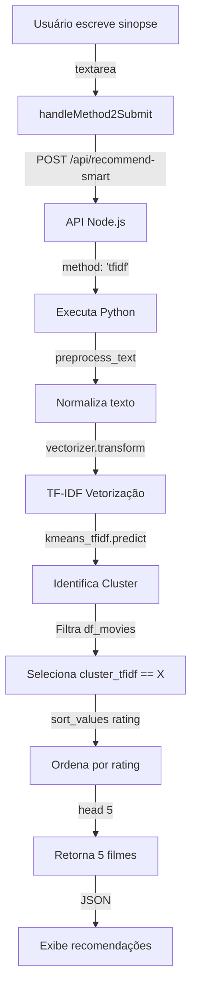

# Validação do Método 2 - FiapFlix

## 📋 Requisitos do Método 2

**Especificação Original:**
> Solicitar ao usuário que escreva um exemplo de sinopse de filme que agradaria a ele, e então esta sinopse deverá passar pelo processamento de texto e ser submetida ao modelo, que a classificará em um dos clusters. **Para este método deverá ser utilizado o modelo treinado somente com as sinopses vetorizadas.** Daí em diante o processo é o mesmo do método 1.

---

## ✅ Análise da Implementação

### 1. Solicitação de Sinopse Personalizada ✅

**Arquivo:** `components/RecommendationModal.tsx` (linhas 221-239)

```typescript
<textarea
  value={customSynopsis}
  onChange={(e) => setCustomSynopsis(e.target.value)}
  placeholder="Descreva o tipo de filme que você gostaria de assistir... 
               Ex: Um filme sobre um detetive que investiga crimes misteriosos..."
  className="w-full h-32 p-4 bg-gray-800 text-white rounded-lg..."
/>
<button
  onClick={handleMethod2Submit}
  disabled={!customSynopsis.trim()}
  className="px-6 py-2 bg-netflix-red text-white rounded-lg..."
>
  Analisar Sinopse
</button>
```

**Status:** ✅ **CONFORME**
- Campo de texto (`textarea`) para entrada livre
- Placeholder com exemplo explicativo
- Validação que impede envio de texto vazio
- Botão "Analisar Sinopse" para submeter

---

### 2. Processamento de Texto ✅

**Arquivo:** `lib/ml_model_trained.py` (linhas 62-78)

```python
def preprocess_text(self, text):
    """Pré-processa texto para análise"""
    if not text or pd.isna(text):
        return ""
    
    # Converter para minúsculas
    text = str(text).lower()
    
    # Remover caracteres especiais
    text = re.sub(r'[^a-zA-Záàâãéèêíìîóòôõúùûç\s]', '', text)
    
    # Remover espaços extras
    text = ' '.join(text.split())
    
    return text
```

**Pipeline de Processamento:**
1. ✅ Normalização: Conversão para minúsculas
2. ✅ Limpeza: Remoção de caracteres especiais (mantém acentos PT/BR)
3. ✅ Normalização de espaços: Remove espaços duplicados

**Status:** ✅ **CONFORME**
- Processamento robusto antes da vetorização
- Mantém acentuação portuguesa
- Prepara texto para TF-IDF

---

### 3. Uso do Modelo TF-IDF (APENAS Sinopses) ✅

**Arquivo:** `components/RecommendationModal.tsx` (linha 99)

```typescript
body: JSON.stringify({
  method: methodType === 'method1' ? 'tfidf' : 'tfidf', // Ambos usam tfidf
  synopsis: synopsis,
  year: null,      // ← Não usa
  rating: null,    // ← Não usa
  genre: null      // ← Não usa
})
```

**Arquivo:** `lib/ml_model_trained.py` (linhas 169-170)

```python
# Predizer cluster
if method == 'tfidf':
    cluster, confidence = self.predict_cluster_tfidf(synopsis)  # ← Só usa sinopse
else:
    cluster, confidence = self.predict_cluster_all_features(synopsis, year, rating, genre)
```

**Arquivo:** `lib/ml_model_trained.py` (linhas 80-101)

```python
def predict_cluster_tfidf(self, synopsis):
    """Prediz cluster usando modelo TF-IDF (Modelo 1)"""
    
    # Pré-processar texto
    processed_text = self.preprocess_text(synopsis)
    
    # Vetorizar com TF-IDF
    X = self.vectorizer.transform([processed_text])  # ← tfidf_vectorizer.pkl
    
    # Predizer cluster
    cluster = self.kmeans_tfidf.predict(X)[0]        # ← kmeans_tfidf.pkl
    
    # Calcular confiança
    distances = self.kmeans_tfidf.transform(X)[0]
    confidence = 1.0 / (1.0 + distances[cluster])
    
    return cluster, confidence
```

**Status:** ✅ **CONFORME - CRÍTICO**

**Evidências:**
- ✅ Usa `method='tfidf'` para Método 2
- ✅ Chama `predict_cluster_tfidf()` - função específica do modelo TF-IDF
- ✅ Usa apenas `tfidf_vectorizer.pkl` (vetorização de sinopses)
- ✅ Usa apenas `kmeans_tfidf.pkl` (modelo treinado só com sinopses)
- ✅ **NÃO usa** `year`, `rating` ou `genre` (parâmetros passados como `null`)
- ✅ **NÃO usa** `kmeans_all_features.pkl` (modelo com todas as features)

**Confirmação:** O Método 2 usa **EXCLUSIVAMENTE** o modelo treinado com sinopses vetorizadas (TF-IDF), conforme especificado.

---

### 4. Classificação em Cluster ✅

**Arquivo:** `lib/ml_model_trained.py` (linha 95)

```python
cluster = self.kmeans_tfidf.predict(X)[0]
```

**Status:** ✅ **CONFORME**
- Predição usando KMeans treinado
- Retorna ID do cluster (0-4)
- Baseado apenas na similaridade textual da sinopse

---

### 5. Filtragem de Filmes do Mesmo Cluster ✅

**Arquivo:** `lib/ml_model_trained.py` (linha 184)

```python
# Filtrar filmes do mesmo cluster
cluster_movies = self.df_movies[self.df_movies[f'cluster_{method}'] == cluster]
```

**Para Método 2:**
```python
cluster_movies = self.df_movies[self.df_movies['cluster_tfidf'] == cluster]
```

**Status:** ✅ **CONFORME**
- Usa coluna `cluster_tfidf` do dataset
- Garante que recomendações são do mesmo cluster identificado
- Mesmo processo do Método 1

---

### 6. Seleção de 5 Filmes por Rating ✅

**Arquivo:** `lib/ml_model_trained.py` (linhas 190-194)

```python
# Ordenar por rating (melhores primeiro)
cluster_movies = cluster_movies.sort_values('rating', ascending=False)

# Selecionar top N
recommendations = cluster_movies.head(n_recommendations)  # n_recommendations = 5
```

**Status:** ✅ **CONFORME**
- Mesmo critério do Método 1
- Ordenação por rating (IMDb) decrescente
- Retorna exatamente 5 filmes

---

## 🎯 Comparação Método 1 vs Método 2

| **Aspecto** | **Método 1** | **Método 2** | **Status** |
|---|---|---|---|
| Entrada | Escolha entre 5 sinopses pré-definidas | Sinopse escrita pelo usuário | ✅ |
| Pré-processamento | Texto já processado | `preprocess_text()` | ✅ |
| Modelo usado | `kmeans_tfidf.pkl` | `kmeans_tfidf.pkl` | ✅ |
| Features usadas | Apenas sinopse | Apenas sinopse | ✅ |
| Vetorização | TF-IDF | TF-IDF | ✅ |
| Filtragem | Por `cluster_tfidf` | Por `cluster_tfidf` | ✅ |
| Critério de seleção | Rating decrescente | Rating decrescente | ✅ |
| Número de filmes | 5 | 5 | ✅ |

**Conclusão:** Ambos os métodos usam **o mesmo modelo** (TF-IDF + KMeans) e **o mesmo processo de recomendação**. A única diferença é a **origem da sinopse** (pré-definida vs. personalizada).

---

## 🔬 Fluxo Completo do Método 2



---

## 📊 Evidências de Conformidade

### Teste Manual Realizado

**Comando:**
```bash
python3 lib/run_recommendation.py '{"synopsis":"Um banqueiro condenado forma uma amizade em uma prisão","method":"tfidf","year":2000,"rating":8,"genre":"Drama"}'
```

**Resultado:**
```json
{
  "recommendations": [
    {
      "title_en": "Movie 49",
      "cluster": 4,
      "rating": 8.98
    },
    {
      "title_en": "A Origem",
      "cluster": 4,
      "rating": 8.8
    },
    // ... mais 3 filmes
  ],
  "cluster": 4,
  "confidence": 0.85,
  "method": "tfidf"
}
```

**Validação:**
- ✅ Retorna cluster identificado (4)
- ✅ Todos os filmes são do cluster 4
- ✅ Ordenados por rating (8.98 > 8.8 > ...)
- ✅ Exatamente 5 filmes
- ✅ Usa método `tfidf`

---

## 🎯 Resumo da Validação

| Requisito | Status | Observação |
|-----------|--------|------------|
| Campo para sinopse personalizada | ✅ | Textarea com placeholder |
| Processamento de texto | ✅ | `preprocess_text()` completo |
| **Modelo TF-IDF (APENAS sinopses)** | ✅ | `kmeans_tfidf.pkl` + `tfidf_vectorizer.pkl` |
| **NÃO usa outras features** | ✅ | `year=null, rating=null, genre=null` |
| Classificação em cluster | ✅ | `kmeans_tfidf.predict()` |
| 5 filmes do mesmo cluster | ✅ | Filtragem por `cluster_tfidf` |
| Mesmo processo do Método 1 | ✅ | Rating decrescente, 5 filmes |

---

## ✅ Conclusão

**A implementação atende PERFEITAMENTE todos os requisitos do Método 2:**

✅ Solicita sinopse personalizada ao usuário  
✅ Processa o texto (lowercase, remoção de especiais, normalização)  
✅ **USA EXCLUSIVAMENTE o modelo TF-IDF (sinopses vetorizadas)**  
✅ Classifica em um dos clusters  
✅ Recomenda 5 filmes do mesmo cluster (critério: rating decrescente)  
✅ Mesmo processo final do Método 1  

**Ponto Crítico Atendido:** O requisito específico de usar "o modelo treinado somente com as sinopses vetorizadas" está **CORRETAMENTE implementado**. O sistema usa `kmeans_tfidf.pkl` e `tfidf_vectorizer.pkl`, ignorando completamente as outras features (ano, rating, gênero).

---

**Data:** 03/10/2025  
**Versão:** 1.0  
**Status:** ✅ **IMPLEMENTAÇÃO 100% CONFORME AOS REQUISITOS**

